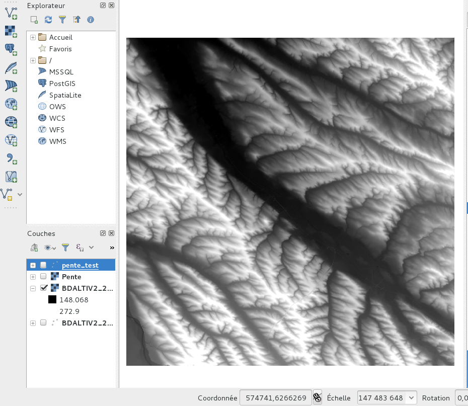
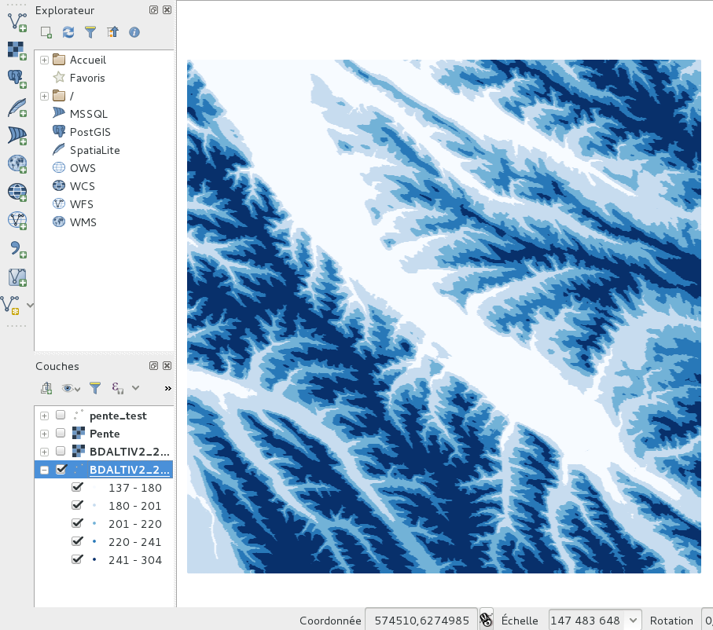
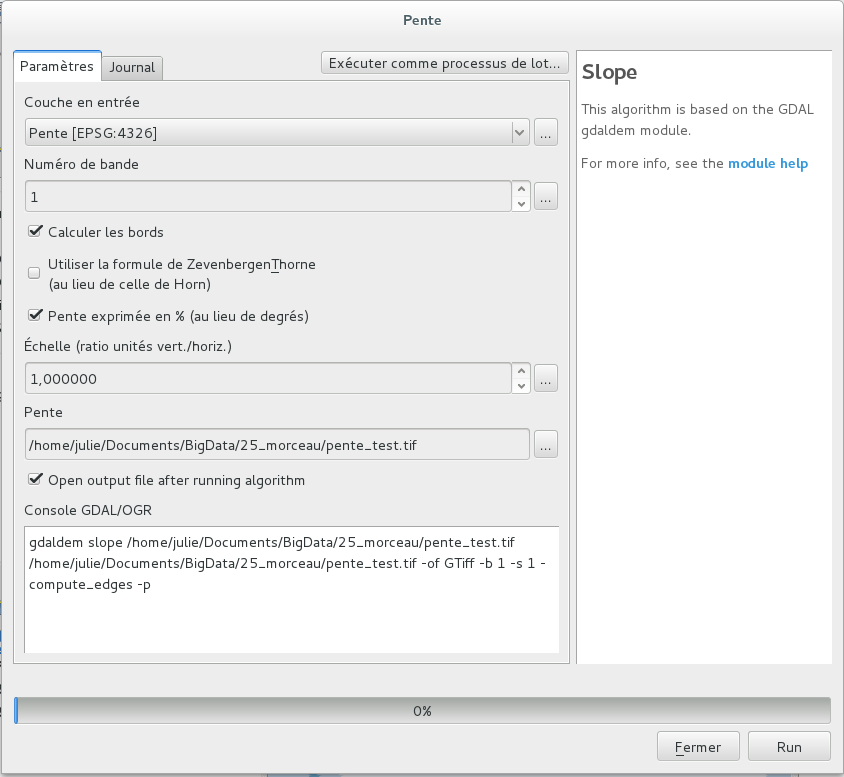
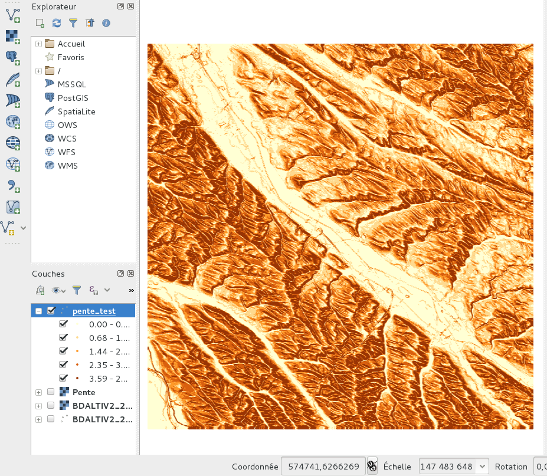
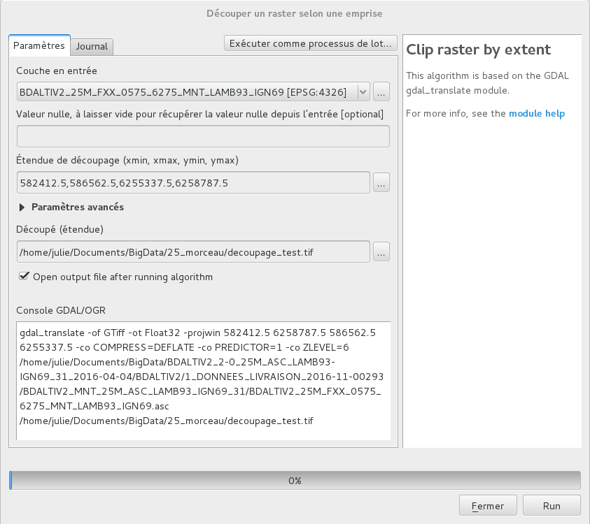

# Calcul de pente #

### Récupération des données ###

*Sources* : [http://professionnels.ign.fr/bdalti](http://professionnels.ign.fr/bdalti) 

Données disponibles :
- Petite zone en 25m
- France métropolitaine en 75m

### Prerequis ###

- postgresql
- postgis
- gdal

Voir l'installation/l'utilisation

### Conversion ASCII en XYZ ###

Avant :

```sh
#! /bin/bash

path='/home/julie/Documents/BDALTIV2_2-0_75M_ASC_LAMB93-IGN69_FRANCE_2017-01-04/BDALTIV2/1_DONNEES_LIVRAISON_2017-02-00100/BDALTIV2_MNT_75M_ASC_LAMB93_IGN69_FRANCE'
folder='/home/julie/Documents/BD_alti'
for filename in $path/*.asc; do
  /usr/bin/gdal2xyz.py -csv $filename $folder/$(basename "$filename" .asc).csv
done
```
Après :


### Calcul des pentes avec GDAL ###


```sh
gdaldem slope /home/julie/Documents/BigData/25_morceau/pente_test.tif /home/julie/Documents/BigData/25_morceau/pente_test.tif -of GTiff -b 1 -s 1 -compute_edges -p
```


### Découpage avec GDAL ###


```sh
gdal_translate -of GTiff -ot Float32 -projwin 582412.5 6258787.5 586562.5 6255337.5 -co COMPRESS=DEFLATE -co PREDICTOR=1 -co ZLEVEL=6 /home/julie/Documents/BigData/BDALTIV2_2-0_25M_ASC_LAMB93-IGN69_31_2016-04-04/BDALTIV2/1_DONNEES_LIVRAISON_2016-11-00293/BDALTIV2_MNT_25M_ASC_LAMB93_IGN69_31/BDALTIV2_25M_FXX_0575_6275_MNT_LAMB93_IGN69.asc /home/julie/Documents/BigData/25_morceau/decoupage_test.tif
```

### Base de donnée ###
```sh
##Connexion a la base
psql bigdata;

##Activation de l'extension PostGIS
bigdata= CREATE EXTENSION postgis;

##Creation de la base MNT
CREATE TABLE test (
  lon numeric(25,5),
  lat numeric(25,5),
  alt numeric(25,5)
);

##Remplissage de la base MNT
COPY test FROM '/home/julie/Documents/BigData/25_morceau/test.csv' WITH ENCODING 'UTF8' DELIMITER ',' CSV HEADER;

##Creation de la base Pente
CREATE TABLE pente (
  lon numeric(25,5),
  lat numeric(25,5),
  pente_deg numeric(25,5)
);

##Remplissage de la base Pente
COPY pente FROM '/home/julie/Documents/BigData/25_morceau/pente_test.csv' WITH ENCODING 'UTF8' DELIMITER ',' CSV HEADER;

##Ajout d'une colonne Geometry
ALTER TABLE pente
ADD COLUMN geom geometry(Point, 4326);

##Remplissage de la colonne
UPDATE pente
SET geom = ST_SetSRID(ST_Point(cast(lon as double precision)
,cast(lat as double precision)), 4326);
```

### Interaction en PHP ###  
```php
<?php

$conn_string = "host=localhost port=5432 dbname=bigdata user=julie password=julie";
$dbconn = pg_connect($conn_string)
      or die("Connexion impossible");
echo 'Connexion réussie';
pg_close($dbconn);

$sql = 'SELECT geom, pente_deg FROM pente';
$pentes = $bdd->exec($sql);
?>
```
