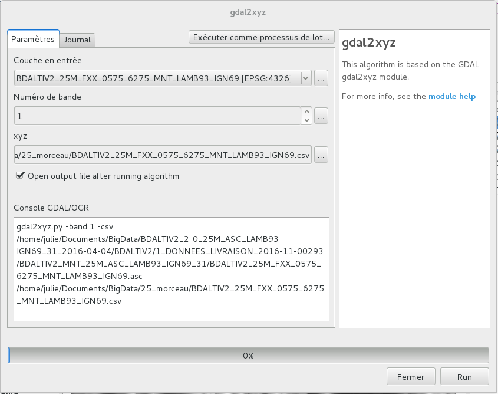
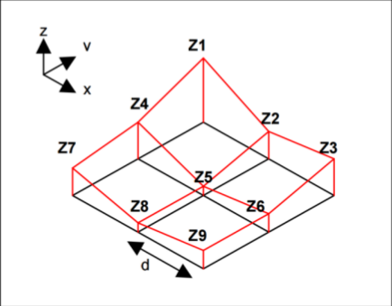

# Calcul de pente #

## Données et algorithme ##

### Récupération des données ###

*Sources* : [http://professionnels.ign.fr/bdalti](http://professionnels.ign.fr/bdalti)

Données disponibles :
- Petite zone en 25m
- France métropolitaine en 75m

### Prerequis ###

- postgresql
- postgis
- gdal

GDAL ([wiki](https://en.wikipedia.org/wiki/GDAL)) est un outil présent dans QGIS permettant de manipuler des données. Nous allons l'utiliser dans la suite du projet.

### Conversion ASCII en XYZ ###

Notre première étape est de convertir les données ASCII en données lisible est manipulation en base.

Avant la conversion :  


La fenêtre graphique de conversion permet de transformer un fichier ASCII en CSV ou TIF. Ici, par exemple, nous transformons un ASC en CSV:  


La ligne de commande correspondante suivante sera réutilisée et adaptée plus tard.
```sh
gdal2xyz.py -band 1 -csv /home/julie/Documents/BigData/BDALTIV2_2-0_25M_ASC_LAMB93-IGN69_31_2016-04-04/BDALTIV2/1_DONNEES_LIVRAISON_2016-11-00293/BDALTIV2_MNT_25M_ASC_LAMB93_IGN69_31/BDALTIV2_25M_FXX_0575_6275_MNT_LAMB93_IGN69.asc /home/julie/Documents/BigData/25_morceau/BDALTIV2_25M_FXX_0575_6275_MNT_LAMB93_IGN69.csv
```
Après la conversion :


### Calcul des pentes ###

#### Différentes méthodes de calcul de pentes ####

Il y a différentes méthodes pour calculer un pente issue des données de MNT.  
Les données sont disposées sous la forme d'une grille régulière, suivant un certain intervalle. Il nous faut donc calculer la pente entre chaque point.

La plus simple est la suivante :   
[http://www.lememento.fr/calcul-pente](http://www.lememento.fr/calcul-pente)  
Dans notre cas, nous avons un problème de la forme suivante :


La première étape est de récupérer les points qui se succèdent.
```SQL
SELECT * FROM data AS data1, data2
WHERE  abs(data2.x - data1.x) <= resolution
AND abs(data2.y - data1.y) <= resolution
```
Par exemple pour le point Z1, la sélection contiendrait Z4, Z5 et Z2. Il nous faudrait garder cette sélection et calculer la pente entre Z1 et les autres.
```SQL
ADD COLUMN pente double precision;
SET pente = (abs(data2.z - data1.z) / sqrt(pow(data2.x - data1.x, 2) + pow(data2.y - data1.y, 2))) * 100;
```
On obtiendrait alors :
```SQL
CREATE TABLE table_pente AS (
SELECT * FROM data AS data1, data2
WHERE  abs(data2.x - data1.x) <= 0.75
AND abs(data2.y - data1.y) <= 0.75)

ALTER TABLE table_pente
ADD COLUMN pente double precision;

UPDATE table_pente
SET pente = (abs(data2.z - data1.z) / sqrt(pow(data2.x - data1.x, 2) + pow(data2.y - data1.y, 2))) * 100;
```

Il y a d'autres méthodes plus recherchées et complexes.

#### Calcul des pentes avec GDAL ####

*Source* :    
[http://www.gdal.org/gdaldem.html](http://www.gdal.org/gdaldem.html)  
[https://gdal.gloobe.org/gdal/gdaldem.html](https://gdal.gloobe.org/gdal/gdaldem.html)

GDAL propose une solution de calcul de pente :


La ligne de commande correspondante suivante sera réutilisée et adaptée plus tard.
```sh
gdaldem slope /home/julie/Documents/BigData/25_morceau/pente_test.tif /home/julie/Documents/BigData/25_morceau/pente_test.tif -of GTiff -b 1 -s 1 -compute_edges -p
```
On obtient le résultat suivant :


### Découpage avec GDAL ###

Nous allons commencer avec un échantillon de données.


```sh
gdal_translate -of GTiff -ot Float32 -projwin 582412.5 6258787.5 586562.5 6255337.5 -co COMPRESS=DEFLATE -co PREDICTOR=1 -co ZLEVEL=6 /home/julie/Documents/BigData/BDALTIV2_2-0_25M_ASC_LAMB93-IGN69_31_2016-04-04/BDALTIV2/1_DONNEES_LIVRAISON_2016-11-00293/BDALTIV2_MNT_25M_ASC_LAMB93_IGN69_31/BDALTIV2_25M_FXX_0575_6275_MNT_LAMB93_IGN69.asc /home/julie/Documents/BigData/25_morceau/decoupage_test.tif
```

### Base de donnée ###
```sh
##Connexion a la base
psql bigdata;

##Activation de l'extension PostGIS
CREATE EXTENSION postgis;

##Creation de la base MNT
CREATE TABLE test (
  lon numeric(25,5),
  lat numeric(25,5),
  alt numeric(25,5)
);

##Remplissage de la base MNT
COPY test FROM '/home/julie/Documents/BigData/25_morceau/test.csv' WITH ENCODING 'UTF8' DELIMITER ',' CSV HEADER;

##Creation de la base Pente
CREATE TABLE pente (
  lon numeric(25,5),
  lat numeric(25,5),
  pente_deg numeric(25,5)
);

##Remplissage de la base Pente
COPY pente FROM '/home/julie/Documents/BigData/25_morceau/pente_test.csv' WITH ENCODING 'UTF8' DELIMITER ',' CSV HEADER;


#### ATTENTION A LA PROJECTION : voir requête échantillon
##Ajout d'une colonne Geometry
ALTER TABLE pente
ADD COLUMN geom geometry(Point, 4326);

##Remplissage de la colonne
UPDATE pente
SET geom = ST_SetSRID(ST_Point(cast(lon as double precision)
,cast(lat as double precision)), 4326)::geography;
```
### Généralisation ###

Avec les données en 75m de la France métropolitaine :
- Conversion et calcul de pentes: voir [Script bash](./executable.sh)
- Remplissage de la base de données : voir [Script bash](./base.sh)

## Affichage et dynamisme ##

### Interaction en PHP ###  
```php
<?php
$conn_string = "host=localhost port=5432 dbname=bigdata user=julie password=julie";
$dbconn = pg_connect($conn_string)
      or die("Connexion impossible");
echo 'Connexion réussie';
pg_close($dbconn);

$sql = 'SELECT geom, pente_deg FROM pente';
$pentes = $bdd->exec($sql);
?>
```

## Visualisation ##
Après avoir importer votre base et mis en place pg sur votre serveur, coupiez le dossier /PageWeb et ouvrez le fichier index.html.  
Attention ! Le chargement de la page est très long car on requête un grand nombre de données et pas en asynchro.

Composition de la page web:  
- une carte (avec la carte de chaleur dessus)  
- deux jauges: la pente moyenne et la pente maximale  
- un diagramme d3.js statique pas très visible pour les données utilisées  
- un diagramme d3.js donut plus lisible pour les données utilisées  

### La carte et la carte de chaleur ###
Les fichiers utilisés sont: index.html, grid.js, codeColor.js.  
Dans index.html:
- on initialise la carte au centre des données  
- à ce jour, on crée une carte de chaleur généralisée mais dont les données sont les résultats des requêtes  
Dans grid.js:  
on crée une carte de chaleur mais vu le nombre de données en requête cette fonction fait planté l'onglet.  
Dans codeColor.js:  
Juste les échelles de couleurs pour la heatmap.  

### Les deux jauges ###
Les fichiers utilisés sont: index.html,liquidFillGauge.js.  
Dans index.html:    
On crée les deux jauges en fonction des résultats des requêtes de pente maximale et moyenne.  
Dans liquidFillGauge.js:  
Configuration de d3.js des jauges.  

### Les deux diagrammes ###
Les fichiers utilisés sont: index.html,liquidFillGauge.js.  
Dans index.html:    
On crée les deux diagrammes en fonction de fichiers .tsv obtenus grâce à des requêtes sur la base de données.  

### Autres ###
La carte de chaleur n'étant pas parfaites de nombreux essais ont été faits, dont un qui peut être retouvés dans /essais/oldmap.js .  
Cet essai est celui de la soutenance, non dynamique et peut représentatif des données.

### Pour aller plus loin ###
- Faire la carte de chaleur avec toutes les données
- Dynamiser la carte de chaleur et les diagrammes en fonction du zoom sur la carte.
