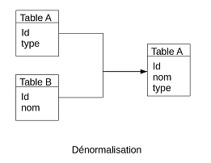

# TP1 #

## Données ##

</br>BANO 93 : Base addresse du 93
</br>SIREN 93 : Base des entreprise dans le 93

## Modélisation avec dbdesigner ##

#### Diagramme EA ####


## Intégration ##

#### Intégration naïve ####

Exemple de création d'une table :
```SQL
CREATE TABLE zip_codes
(ZIP char(5), LATITUDE double precision, LONGITUDE double precision,
CITY varchar, STATE char(2), COUNTY varchar, ZIP_CLASS varchar);
```
Exemple d'intégration d'un fichier CSV dans une table :
```SQL
COPY zip_codes FROM '/path/to/csv/ZIP_CODES.txt' DELIMITER ',' CSV;
```

Mais la première étape est de faire le lien entre les deux tables pour pouvoir ajouter des coordonnées aux entreprises. Pour cela il faut comparer les adresses. Nous avons essayer d'assimiler les attributs.


L'idée serait de faire un script avant l'intégration de la base pour homogénéiser la structure des adresses :

- Numéro + Compl: nombre + B,C,A ou T...
- Nom de voie : Type + Intitulé en Majuscule sans caractères spéciaux
- Code postal : inchangé
- Commune : en Majuscule sans caractères spéciaux

#### Nouvelles tables avec homogénéisation des adresses #####

Dictionnaire des type de voies :
cf Annexe1

Transformation de BAN :
```py
import csv

fichier_entree = open("Data/BAN_93.csv","r")
cr = csv.reader(fichier_entree, delimiter=';')

fichier_sortie = open("BAN_93_modif3.csv", "w")
cw = csv.writer(fichier_sortie, delimiter=';',lineterminator = "\n")

// Modification de la 4ème colonne, la répétition pour concorder avec la table siren
for row in cr:
    if row[4]=="BIS" :
        a = "B"
    elif row[4]=="TER":
        a = "T"
    elif row[4]=="QUATER":
        a = "Q"
    elif row[4]=="QUINQUIES":
        a = "C"
    else:
        a = row[4]
    nv = row[3] + a
    cw.writerow([row[0],nv,row[5],row[6],row[9],
    row[10],row[11],row[12],row[13],row[14]])

	// on garde id, le numéro avec la répétition de l'adresse (12B), le code insee, le code postal, le type et le nom de l'adresse,
	la commune et ses coordonnées géographiques.
fichier_entree.close()
fichier_sortie.close()
```
Transformation de SIREN :
```py
import csv
from Dico_voie import dicoVoie

fichier_entree = open("Data/siren_93.csv","r")
cr = csv.reader(fichier_entree, delimiter=';')

fichier_sortie = open("siren_93_modif3.csv", "w")
cw = csv.writer(fichier_sortie, delimiter=';',lineterminator = "\n")

// Modification de la colonne des types de voie pour enlever les abréviations
for row in cr:
    t ='';
    if dicoVoie.has_key(row[18]):
        t = dicoVoie.get(row[18])
    nv = row[16]+row[17]
    ad=t+" "+row[19]
    cw.writerow([row[0],row[1],nv,ad,row[20],
    row[28],row[36],row[43],row[60]])

	// On garde l'id de l'entreprise et du magasion, le numéro et la répétition de l'adresse ensemble, le type et le nom de l'adresse,
	la commune, le nom de l'entreprise et du magasin.

fichier_entree.close()
fichier_sortie.close()
```
Les bases manipulées après :


Equivalent en SQL :
```SQL
CREATE TABLE bano_modif3 (
	id varchar(80),
  numero_rep varchar(80),
	code_insee varchar(80),
	code_post varchar(80),
	nom_afnor varchar(80),
	libelle_acheminement varchar(80),
	x NUMERIC(24,3) NOT NULL,
	y NUMERIC(24,3) NOT NULL,
	lat NUMERIC(24,15) NOT NULL,
	lon NUMERIC(24,15) NOT NULL
);
COPY bano_modif3 FROM 'G:/BDD/BDB_1/modif/BAN_93_modif3.csv' WITH ENCODING 'UTF8' DELIMITER ';' CSV HEADER;


CREATE TABLE siren_modif3 (
 siren varchar(80),
 nic varchar(80),
 numvoie varchar(80),
 libvoie varchar(80),
 codpos varchar(80),
 libcom varchar(80),
 enseigne varchar(80),
 libapet varchar(255),
 nomen_long varchar(255)
);
COPY siren_modif3 FROM 'G:/BDD/BDB_1/modif/siren_93_modif3.csv' WITH ENCODING 'UTF8' DELIMITER ';' CSV HEADER;
```

#### Lien entre les bases par rapport aux adresses ####

Parmis les 206055 lignes dans SIREN, on récupérons 204353 corrélations.

Par jointure :
```SQL
select * from siren_modif2
JOIN bano_modif2 ON siren_modif2.codpos=bano_modif2.code_post
AND siren_modif2.libvoie=bano_modif2.nom_afnor
AND siren_modif2.numvoie=bano_modif2.numero
```
Par création d'une nouvelle table en gardant les attributs dont nous avons besoin :
```SQL
CREATE TABLE entre_loc AS (
select siren_modif2.numvoie, siren_modif2.libvoie,
siren_modif2.codpos, siren_modif2.libcom,
enseigne, libapet, nomen_long, code_insee, lat,
lon, geom from siren_modif2
INNER JOIN bano_modif2
ON siren_modif2.codpos=bano_modif2.code_post
AND siren_modif2.libvoie=bano_modif2.nom_afnor
AND siren_modif2.numvoie=bano_modif2.numero)
```
```SQL
CREATE TABLE entre_loc3 AS (
select siren_modif3.siren, siren_modif3.nic,
siren_modif3.numvoie, siren_modif3.libvoie,
siren_modif3.codpos, siren_modif3.libcom,
id, enseigne, libapet, nomen_long, code_insee,
lat, lon, geom from siren_modif3
INNER JOIN bano_modif3
ON siren_modif3.codpos=bano_modif3.code_post
AND siren_modif3.libvoie=bano_modif3.nom_afnor
AND siren_modif3.numvoie=bano_modif3.numero)
```

## Avec coordonnées GPS ##

#### Calcul des distance ####

On ajoute un champ de type géometrie à la table bano en prenant la latitude et la longitude.
```SQL
ALTER TABLE bano_modif2
ADD COLUMN geom geometry(Point, 4326);
```
```SQL
UPDATE bano_modif2
SET geom = ST_SetSRID(ST_Point(cast(lat as double precision)
,cast(lon as double precision)), 4326)
```

On ajoute un champ de type géometrie à la jointure en prenant la geometrie et les coordonnées d'un point.
```SQL
ALTER TABLE entre_loc
ADD COLUMN distance double precision;
```
Le calcul de distance en théorie est :
```SQL
SELECT ST_Distance(
  bano_modif2.geom,
  ST_Point(2.585134,48.841023)::geography
) as distance FROM bano_modif2;
```
En appliquant à notre table, nous obtenons :
```SQL
UPDATE entre_loc
SET distance = ST_Distance(geom,
ST_Point(2.5851349,48.841023)::geography)
```
#### Requêtes par rapport à un rayon ####

requêtes permettant d’obtenir la liste des entreprises dans un rayon défini sur une activité choisie trier par ordre croissant en fonction de la distance.
```SQL
-- Exemple
SELECT * FROM Table WHERE distance <= valeur
ORDER BY distance ASC
-- En pratique
SELECT * FROM entre_loc WHERE distance <= 10000
ORDER BY distance ASC
```

#### Requêtes par rapport à une activité ####

Il y a 633 activités différentes répertorié dans SIREN 93.
```SQL
-- Exemple
WHERE libapet LIKE '%activite%'
-- En pratique
SELECT * FROM entre_loc
WHERE libapet LIKE '%boulangerie%'
```
#### Requêtes par rapport à la distance et à l'activité ####

Par une jointure :
```SQL
select * from siren_modif2
INNER JOIN bano_modif2
ON siren_modif2.codpos=bano_modif2.code_post
AND siren_modif2.libvoie=bano_modif2.nom_afnor
AND siren_modif2.numvoie=bano_modif2.numero
WHERE libapet LIKE '%boulangerie%'
AND ST_Distance(ST_SetSRID(ST_Point(cast(lat as double precision),
cast(lon as double precision)), 4326),
		ST_Point(2.5851349,48.841023)::geography) <= 5000
		ORDER BY ST_Distance(ST_SetSRID(ST_Point(cast(lat as double precision),cast(lon as double precision)), 4326),
		ST_Point(2.5851349,48.841023)::geography) ASC
```
</br>Durée totale d'exécution de la requête :1132 ms.
</br>35 lignes récupérées.

Par une table :
```SQL
SELECT * FROM entre_loc3
WHERE libapet LIKE '%boulangerie%'
AND distance <= 5000 ORDER BY distance ASC
```
</br>Durée totale d'exécution de la requête :122 ms.
</br>35 lignes récupérées.

## Dénormalisation ##



## Synthèse des méthodes ##


| Benchmark        | Jointure           | Nouvelle table  |
| ---------------- |:------------------:| ---------------:|
| Sans clef/index  | o                  |               + |
| Avec clef        |                    |               + |
| Avec clef/index  |                    |               + |

Optimisation avec les formes normales

Optimisation avec la dénormalisation


## Annexe 1 : dictionnaire ##

```py
dicoVoie = {
"ALL":"ALLEE",
"AV":"AVENUE",
"BD":"BOULEVARD",
"CAR":"CARREFOUR",
"CHE":"CHEMIN",
"CHS":"CHAUSSEE",
"CITE":"CITE",
"COR":"CORNICHE",
"CRS":"COURS",
"DOM":"DOMAINE",
"DSC":"DESCENTE",
"ECA":"ECART",
"ESP":"ESPLANADE",
"FG":"FAUBOURG",
"GR":"GRANDE RUE",
"HAM":"HAMEAU",
"HLE":"HALLE",
"IMP":"IMPASSE",
"LD":"LIEU DIT",
"LOT":"LOTISSEMENT",
"MAR":"MARCHE",
"MTE":"MONTEE",
"PAS":"PASSAGE",
"PL":"PLACE",
"PLN":"PLAINE",
"PLT":"PLATEAU",
"PRO":"PROMENADE",
"PRV":"PARVIS",
"QUA":"QUARTIER",
"QUAI":"QUAI",
"RES":"RESIDENCE",
"RLE":"RUELLE",
"ROC":"ROCADE",
"RPT":"ROND POINT",
"RTE":"ROUTE",
"RUE":"RUE",
"SEN":"SENTIER",
"SQ":"SQUARE",
"TPL":"TERRE PLEIN",
"TRA":"TRAVERSE",
"VLA":"VILLA",
"VLGE":"VILLAGE"
}
```
